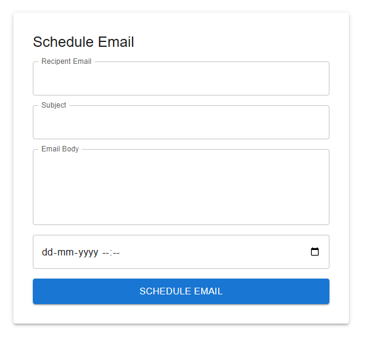

# 📧 Email Scheduler Application

A full-stack web application that allows users to schedule and manage emails efficiently.  
The system supports secure authentication, automated background jobs, and cloud deployment.

---

## 🚀 Features

- ✅ User Authentication & Authorization (JWT Based)
- ✅ Create, Schedule, Update and Delete Emails
- ✅ Automated Email Sending using Cron Jobs
- ✅ Form Validation with User-Friendly Error Messages
- ✅ Responsive UI using Material UI
- ✅ RESTful API Architecture
- ✅ Cloud Deployment on AWS EC2

---

## 🛠️ Tech Stack

### Frontend
- React.js
- Material UI
- Axios
- Form Validation

### Backend
- Node.js
- Express.js
- MongoDB
- Node Cron

### Cloud & Deployment
- AWS EC2
- Nginx (Optional if used)
- PM2 (Optional if used)

---

## 📂 Project Structure
project-root
│
├── frontend
│ ├── components
│ ├── pages
│ ├── services
│ └── App.js
│
├── backend
│ ├── controllers
│ ├── routes
│ ├── models
│ ├── cron
│ └── server.js
│
└── README.md

---

## ⚙️ Installation & Setup

### 1️⃣ Clone the Repository
git clone https://github.com/TridebPanigrahi/email-scheduler.git

### 2️⃣ Backend Setup
cd backend
npm install
npm start

### 3️⃣ Frontend Setup
cd frontend
npm install
npm start

---

## ⏰ Cron Job Functionality

- Background scheduler runs at defined intervals
- Automatically checks pending emails
- Sends scheduled emails without manual intervention

---

## 🌐 Deployment

The application is deployed on **AWS EC2** instance.

### Deployment Steps:
- Build frontend using `npm run build`
- Host frontend build on server / S3
- Run backend using PM2 / Node
- Configure security group and port access

---

## 📸 Screenshots

Project URL: https://dwb1k0tfh2okm.cloudfront.net/

---

## 📌 Future Enhancements

- Email templates support
- Retry mechanism for failed emails
- Dashboard analytics
- Notification system

---

## 👨‍💻 Author

**Trideb Panigrahi**

- GitHub: https://github.com/TridebPanigrahi/email-scheduler
- LinkedIn: https://www.linkedin.com/in/trideb-panigrahi-6a7297209/

---

## ⭐ If you like this project, give it a star!